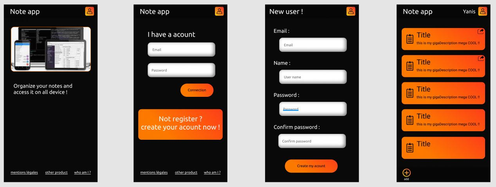

# Note List
projet node.js de bloc notes.

## Installation :
- npm install
- npm require express
- npm require express-session
- npm require body-parser
- copier le 'config.sample.js' situé dans "/config/" et le renomé 'config.sample'
- completer les champs vide par vos identifiant de BDD

### objectifs :
- Completer le CRUD (Update et Delete)
- Ajouts des utilisateurs (chaque utilisateur son dossier)
- Création d'un ID qui relie les fichiers TXT sur le serveur à la base de donnée (ID créer sur le serveur en mis dans le nom du fichier)
- Création de compte